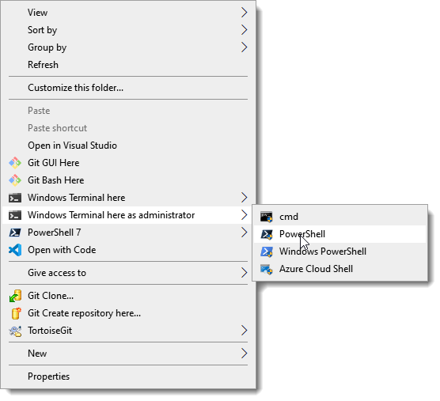
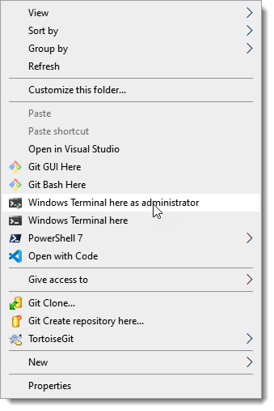

# PowerShell Scripts to Install/Uninstall Context Menu Items for Windows Terminal

## Install

1. [Install Windows Terminal](https://github.com/microsoft/terminal).
1. [Install PowerShell 7](https://docs.microsoft.com/en-us/powershell/scripting/install/installing-powershell-core-on-windows?view=powershell-7).
1. Launch PowerShell 7 console as administrator, and run `install.ps1` to install context menu items to Windows Explorer.

   > Quickest way to run the latest script from GitHub at an elevated PowerShell 7 console is

   > ``` powershell
   > Set-ExecutionPolicy Bypass -Scope Process -Force; [System.Net.ServicePointManager]::SecurityProtocol = [System.Net.ServicePointManager]::SecurityProtocol -bor 3072; iex ((New-Object System.Net.WebClient).DownloadString('https://raw.githubusercontent.com/punk99/WinTerminal/master/install.ps1'))
   > ```

   > Quickest way to run the latest UNINSTALL script from GitHub at an elevated PowerShell 7 console is

   > ``` powershell
   > Set-ExecutionPolicy Bypass -Scope Process -Force; [System.Net.ServicePointManager]::SecurityProtocol = [System.Net.ServicePointManager]::SecurityProtocol -bor 3072; iex ((New-Object System.Net.WebClient).DownloadString('https://raw.githubusercontent.com/punk99/WinTerminal/master/uninstall.ps1'))
   > ```

Now the menu items are added to Windows Explorer context menu.

> The menu items are organized in the `default` layout. Other layouts such as `mini` and `flat` give different look and feel. To apply an alternative layout (like `mini`), simply run `install.ps1 mini`.



Figure 1: Default layout


Figure 2: Flat layout



Figure 3: Mini layout

## Uninstall
1. Run `uninstall.ps1` to uninstall context menu items from Windows Explorer.

> To uninstall an alternative layout (like `mini`), run `uninstall.ps1 mini`.

## Notes
The current release only supports Windows 10 machines (Windows Terminal restriction) and Windows Terminal installed via the store or .appx file.

> If Windows Terminal is installed via Scoop, [scripts from another repo](https://github.com/grimux/windowsterminal-shell-scoop/tree/scoop-support) might help.

The install script must be run as administrator.

> That's because it pulls out data from Windows Terminal's installation folder, which is locked down by Windows 10.

PowerShell 7 installed from Microsoft Store is not supported by the scripts (more details can be found in [#37](https://github.com/lextm/windowsterminal-shell/issues/37)).

`install.ps1` and `uninstall.ps1` only manipulate current user's Windows Explorer settings for the context menu items, and do not write to Windows Terminal settings.

> So different users on the same machine must install the context menu items separately, but possibly with different layouts.

Downloading Windows Terminal icon from GitHub (in `install.ps1`) requires internet connection, but in general is just an optional step that won't be executed in most cases.
